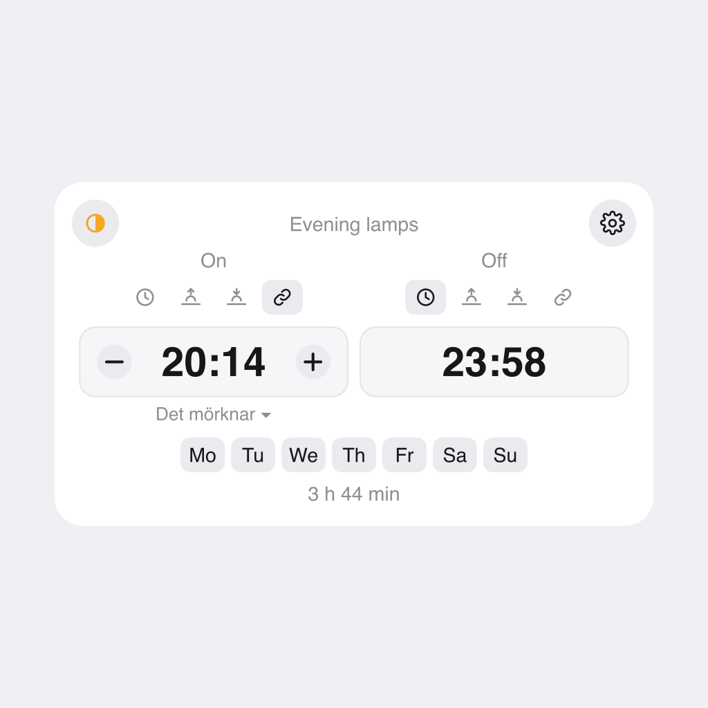
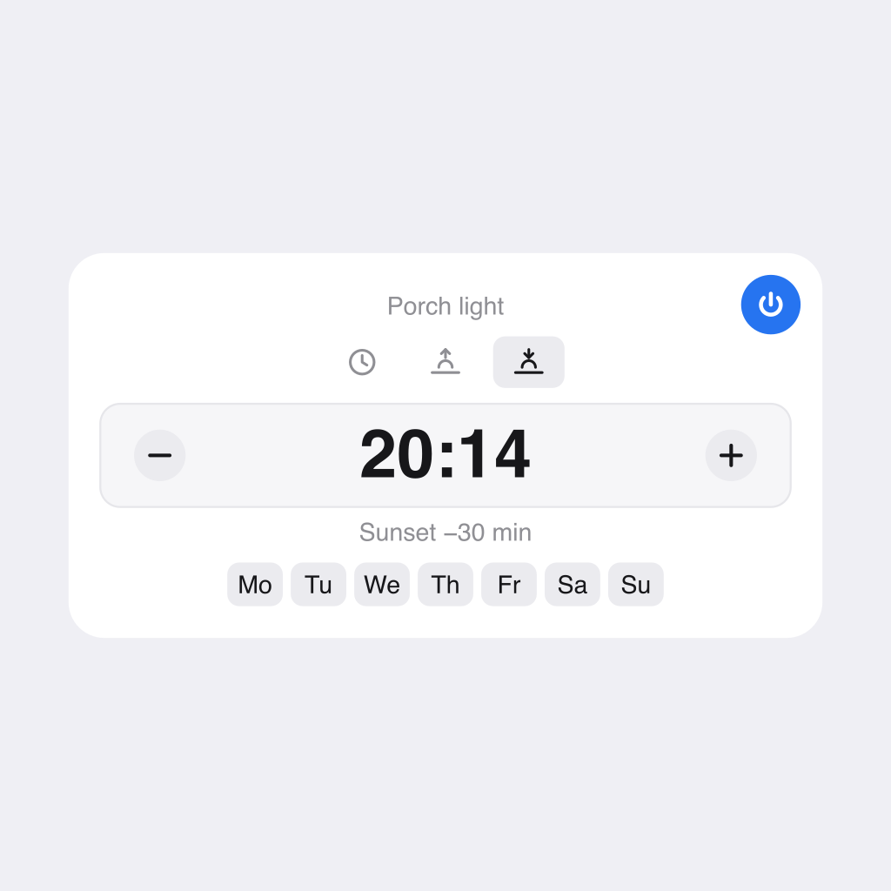

# Timetable

A Homey app that turns a schedule into a **device**, so the times live somewhere you can
see and change them — including from a dashboard tile — instead of being buried inside a
Flow. A range also owns the devices it switches, which makes it a light group with a
schedule attached.



The evening lamps above come on at *Dusk* and go off at 23:58. *Dusk* is a device too —
sunset plus a quarter of an hour, so it moves through the year on its own, and every
range that follows it moves with it:



## Getting started

The pictures above are two **widgets**, each showing one **device**. Those are separate
things, and the widget is the optional half: a schedule works perfectly well without one,
through its device settings, its tile and its Flow cards. The widget is how you put it
somewhere the household can reach it.

1. **Add a device.** *Devices → ✚ → Timetable →* **Time** or **Time Range**. Name it after
   what it schedules rather than when — *Dusk*, *Evening lamps* — because the time is the
   part that will change.
2. **Set its times.** Open the device and use its settings: a fixed `HH:MM`, or sunrise or
   sunset with an offset. A range also asks for an end, and for the devices it switches.
3. **Put it on a dashboard**, if you want it there. *Edit the dashboard → add a widget →*
   **Time Picker** for a Time device, **Time Range Picker** for a range. A freshly added
   widget shows *"Pick a Time device in the settings"* and nothing else until you open the
   widget's own settings and choose which device it shows. That step is the one people
   miss: adding the widget does not attach it to anything by itself.

One widget shows one device, so a household with three schedules on the wall has three
widgets. There is no widget that lists them all.

## Why

In Homey a schedule is normally an invisible property of a Flow: `19:25` sits inside a
trigger card, and changing it means opening the Flow editor. That makes "when do the
lamps come on?" a question only the person who edits Flows can answer, let alone change.

These devices give a schedule a name, a place in the device list, Flow cards, Flow tags,
and a widget anyone in the household can adjust.

## Devices

### Time

A single moment in the day.

| | |
|---|---|
| Settings | `Set by` (fixed time, sunrise or sunset), `Fixed time` (`HH:MM`), `Offset`, repeat weekdays |
| Tile | A `Schedule` toggle, which pauses and resumes it |
| Trigger | **The time is reached** — carries a `Time` tag |
| Actions | **Set the time** — accepts a literal time or a tag; **Set the time from the sun**; **Pause** / **Resume the schedule** |
| Condition | **The schedule is running** |
| Tags | `Time` — the time it comes to today |

### Time Range

A start and an end, plus a live state for "are we inside the window right now?".

Think of it as a sensor whose reading is the window, not a pair of stored values: the
two times are its configuration, the same way a motion sensor has a sensitivity, and the
reading is **Within range**, which the device keeps up to date on its own.

| | |
|---|---|
| Settings | `Start` and `End`, each a fixed time, an offset from sunrise or sunset, or another Time device; devices to switch; repeat weekdays |
| Tile | On/off switches the connected devices; a separate `Schedule` toggle pauses the schedule |
| Triggers | **The range starts**, **The range ends** — each carries a `Time` tag |
| Conditions | **The time is / is not within the range**; **The schedule is running** |
| Actions | **Set the start time**, **Set the end time**, the same two **from the sun** and **from a device**; **Pause** / **Resume the schedule**; Homey's own **on / off / toggle** switch the connected devices |
| Tags | `Start`, `End`, `Within range` |

A typical pair of Flows:

```
WHEN  The range starts (Evening lamps)  →  THEN  turn on Evening lamps
WHEN  The range ends   (Evening lamps)  →  THEN  turn off Evening lamps
```

## Following the sun

Every time can either be fixed or track **sunrise** or **sunset**, with an offset in
minutes — `sunset − 30` for the lamps, `sunrise + 15` for the blinds. The device works
out the real time for each day itself, from Homey's own location, so it drifts through
the year on its own and needs no Flow to maintain it. `Sunset – Sunrise` is a range that
is active exactly while it is dark.

The published tag is always the concrete time the schedule comes to *today*, so a
notification can say "the lamps go on at 20:14" without any further arithmetic.

Two consequences worth knowing. Far enough north there are days with no sunrise or no
sunset at all: on those the slot simply does not fire, and its tag reads `--:--`. And an
offset large enough to cross midnight wraps onto the same calendar day, so an unusual
`sunset + 3 h` where the sun sets at 23:00 fires at 02:00 that morning; offsets that stay
within the day are exact.

## Sharing one time between ranges

A range's start or end can also **follow a Time device**, with the same offset field. Define
one Time device — *Dusk* in the pictures above, itself following sunset — and point as many
ranges at it as you like; moving it moves all of them at once.

```
Dusk (Time, sunset +15)
   ↑                ↑
Evening lamps    Outdoor lights
(range start)    (range start −10)
```

Only a range can follow, and only a Time device can be followed, so a Time device is always a
leaf and no reference can form a cycle. The range borrows the *time* alone: its own weekdays
still decide which days it runs, and pausing the followed device stops that device firing its
own trigger without moving the ranges that point at it. A reference to a device that no longer
exists resolves to nothing, exactly like a polar night — `--:--`, and it does not fire.

Pick the device in the widget's `Set by` strip, or in the **Set the start time from a device**
Flow card. The device's own settings page has no device picker — Homey's settings schema has no
such field — so the reference is stored as `Det mörknar (6f8ed1f4-…)`: readable there, and still
resolved by the id, so renaming the followed device does not break it. Typing a bare name into
that field works too, and is the one form a rename *does* break.

## Switching devices without a Flow

A range can turn devices on when it starts and off when it ends, with no Flow involved.
Tick the devices from the range widget's **cog menu → Devices**, or from the app's settings
page (*Settings → Apps → Timetable*). Anything with an on/off capability is listed, whichever
app owns it; the widget's list has a search box, because a house can have a hundred of them.

**The range's own on/off is the devices**, so its tile is a light switch and Homey's
built-in **on**, **off** and **toggle** actions switch whatever the range currently controls.
Point a Flow at the range instead of at each lamp, and edit the membership in one place.

Pausing the schedule is separate, on its own **Schedule** toggle, with **Pause the schedule**
and **Resume the schedule** actions and a **The schedule is running** condition. A paused
range keeps its times, days and devices — it just stops acting on the clock, and its
on/off still works by hand.

The widget's button is the manual override to the schedule's automation: same devices, same
on/off, without waiting for the range. Switching devices from the schedule is
**edge-triggered**, exactly as the equivalent Flow would be: the range acts at its
start and at its end and never in between, so a lamp you switch off by hand inside a range
stays off instead of being corrected on the next tick. A paused range switches nothing. If
one device is unreachable the rest are still switched, and the failure is logged.

The device settings page also has a plain `Devices` field, a comma-separated list in the same
`Name (id)` form, for when you would rather not open a picker. Typing bare names there works
as well.

## Behaviour worth knowing

**Ranges may cross midnight.** `22:00 – 06:00` starts in the evening and ends the next
morning. A range is active from its start minute up to, but not including, its end
minute. Setting both times the same makes the range *never* active, rather than always.

**Weekdays select the day a range starts.** `22:00 – 06:00` on *Monday* means the night
that begins on Monday, and it closes on Tuesday morning. Judging each end on its own
calendar day would leave the range open until the following Monday. Leave every day
unticked to repeat daily.

**Pausing keeps everything.** The `Schedule` toggle stops the device acting on its times
without losing them, so pausing over a holiday does not cost you your weekday selection.
Pausing a range that is currently running forces **Within range** to false but does *not*
fire **The range ends** — pausing means *stop scheduling*, not *run the end action now*. It
also leaves the connected devices alone; a paused range's on/off still works by hand.

**Times are read in Homey's own timezone**, compared against the wall clock on every
tick. That is what makes the scheduler survive daylight-saving changes, restarts and
clock corrections. At the spring transition a schedule inside the skipped hour does not
fire at all that day; at the autumn transition a schedule inside the repeated hour fires
once, not twice.

## Widgets

**Time Picker** and **Time Range Picker** put the times, the weekday strip and the controls on
the dashboard. A widget's own settings choose *which schedule it shows* — that is all they do.

Everything else is edited in the widget itself. Each time has a `Set by` strip — clock,
sunrise, sunset, and on a range a fourth for following a Time device, which then offers a
dropdown of them. The `−` and `+` step the offset by five minutes, and the big number is
always the time it comes to today.

The Time Range Picker's top-right **cog** opens a small menu: pause or resume the schedule,
and **Devices**, which is where you choose what the range switches — a searchable list of
everything in your Homey with an on/off capability. The Time Picker keeps a plain pause
button, having nothing else to put in a menu.

Its top-left button shows what those devices are doing right now — lit when they are all on,
plain when all off, and a half-filled amber circle when some are on and some are not. Tapping
turns everything on only when everything is off; from any other state, including mixed, it
turns everything off. It is hidden entirely when the range switches nothing.

Changes made anywhere — widget, device settings, the app's settings page, or a Flow action —
show up in an open widget immediately. A device switched from somewhere else entirely, by a
Flow of your own or a wall switch, is picked up within half a minute: Homey sends a widget no
events for devices this app does not own, so that corner button polls.

## Development

```sh
npm install
npm test                 # scheduler behaviour: DST, weekday semantics, sun times
npx homey app validate --level publish
npx homey app install
./artwork/build.sh       # redraw the mock-ups and rasterise (needs rsvg-convert)
```

Written in TypeScript. `tsconfig.json` must keep `outDir: "./.homeybuild"` — the Homey
CLI refuses to build otherwise.

## Requirements

Homey Pro. Dashboard widgets are not available on Homey Cloud.

The app asks for two permissions:

- *Read Homey's location*, which is what sunrise and sunset are computed from. Nothing
  leaves the Homey — the times come from an algorithm in `lib/sun.ts`, not a web service.
- *Full access to Homey*, which is the only permission that allows switching a device
  owned by another app. Homey has no narrower "control devices" permission, so a range
  cannot turn a lamp on without it. The app uses it for exactly two calls: listing devices
  that have an on/off capability, and setting `onoff` on the ones you picked.

## Licence

MIT
